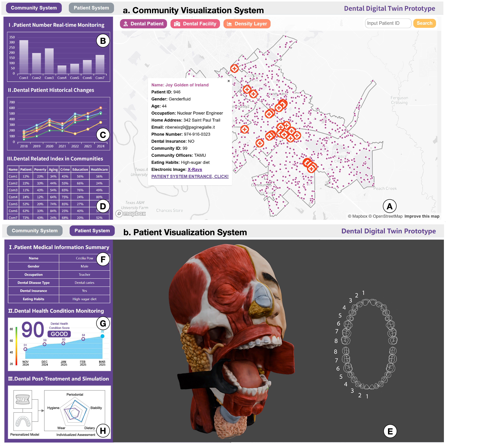

# Dental Digital Twin Prototype

A prototype of the Community–Patient multi-scale oral health visualization system.

Live demo: https://wangcheer97.github.io/dental-digital-twin/

## 3D model attribution

The 3D model used in the patient visualization interface was sourced from "Head and Neck Anatomy for Dentistry" by the University of Dundee, CAHID (https://sketchfab.com/anatomy_dundee), available at Sketchfab, licensed under CC BY 4.0 (https://creativecommons.org/licenses/by/4.0/).

## License

Source code: MIT. Map data © Mapbox © OpenStreetMap contributors. The anatomy model is CC BY 4.0 as stated above.
